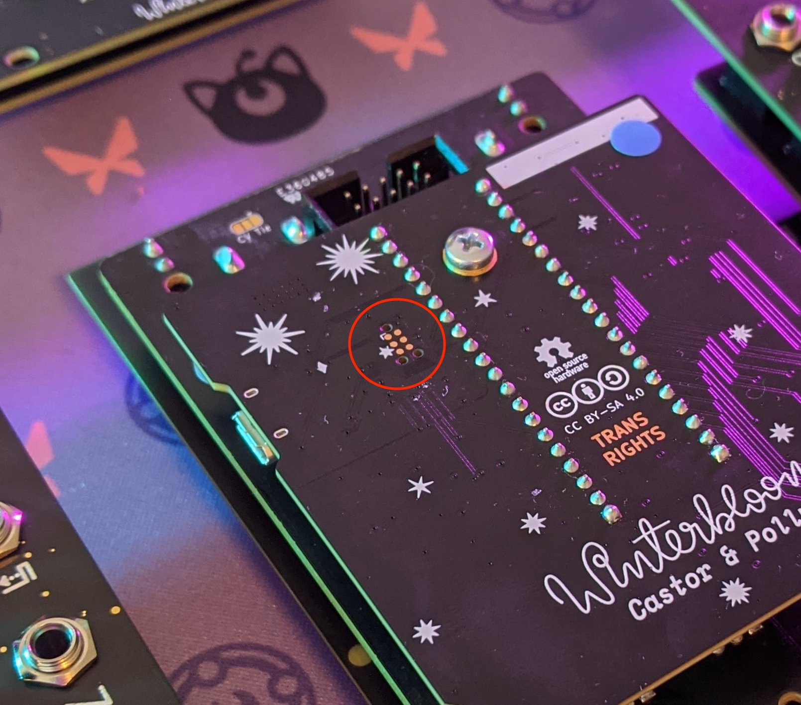

# Contributing to Castor & Pollux / Gemini

Oh hey, it's super cool that you're interested in contributing. We love contributors! Before you jump in, take a minute to:

1. Read our [Code of Conduct](CODE_OF_CONDUCT.md)
2. Read our [license](LICENSE.md) - it's important to know what rights you have and cede when contributing to this project.
3. For anything that can't be explained in one sentence, please [file an issue](https://github.com/theacodes/Winterbloom_Castor_and_Pollux/issues) about what you want to contribute. This gives us a chance to talk before you get too deep into things. We promise that it'll help make your experience more fun. If there's an existing issue that's related, feel free to comment on it.
4. Read through our [commit and pull request conventions](#commit-conventions)
5. If you want to help out with the user guide, read through the [contributing to the user guide](#contributing-to-the-user-guide) section.
6. If contributing changes to the firmware (Gemini), read through the [contributing to the firmware](#contributing-to-the-firmware) section.
7. If contributing changes to the hardware designs, read through [contributing to the hardware](#contributing-to-the-hardware) section.


## Commit & Pull Request conventions

We aren't super rigid here and we're happy to rename your PR/commit to the right format, but, if you wanna help us out you can write your commits in this form:

```plaintext
{category}: {short description}

{long description}

Fixes / Related to / Part of #{issue number}
```

For `category`, add whichever of these fits:

* `docs` for anything related to the [user guide](/user_guide)
* `hardware` for anything related to the [hardware](/hardware)
* `firmware` for anything related to the [firmware](/firmware) that don't fit into any other category
* `build` for anything related to building the firmware, such as changes to the Makefiles or generated code.
* `third_party` for anything that touches code in [firmware/third_party](firmware/third_party)
* `settings editor` for changes related to the WebMIDI settings editor at [user_guide/docs/settings.md](user_guide/docs/settings.md).
* `factory` for changes related to the [factory setup scripts](factory/).
* `meta` for changes to project-wide things like the README, this file, scripts, etc

You can add multiple categories or leave it out and we'll figure it out together. :)

For pull requests, please keep in mind we'd rather you send one that's not quite ready and start a discussion that keep a big change secret and send it all at once! That's also why we recommend [filing an issue](https://github.com/theacodes/Winterbloom_Castor_and_Pollux/issues) before getting starting on changing the code.

## Contributing to the user guide

Did you find a typo? Got a hot tip you want to add? Wonderful! The user guide is located in the [user_guide](user_guide/) directory. It's built using [MkDocs](https://www.mkdocs.org/) so as long as you know [Markdown](https://en.wikipedia.org/wiki/Markdown) you can contribute!

You don't have to test your changes to the user guide locally, but, if you want to you'll need to install some Python packages:

```bash
$ cd user_guide
$ python3 -m pip install -r requirements.txt
```

After that you can run MkDocs to test out your changes:

```bash
$ mkdocs serve
```

## Contributing to the hardware

The [hardware design](hardware/) was created using [KiCAD](http://kicad.org/). That should be all you need to edit the hardware design files.

When sending pull requests that make hardware changes, please be *very descriptive* about what your change does. This helps us out because it's actually kind of hard to review changes to KiCAD files.


## Contributing to the firmware

The firmware is the most complicated bit to contribute to, but, we're happy to guide you along the way. Please take a moment to look over the guidelines here- we don't expect you to get them perfectly right the first time, but you'll have to make sure that your pull request follows these guidelines before we can merge.

## General information

Castor & Pollux's firmware is called **Gemini**. It's written in C using the [GNU Dialect of ISO C17](https://gcc.gnu.org/onlinedocs/gcc/C-Dialect-Options.html#C-Dialect-Options).

Gemini runs on a *Microchip SAM D21* microcontroller. It's a 48 MHz, 32-bit ARM Cortex-M0+. The specific part used in Castor & Pollux is the [ATSAMD21G18A](https://www.microchip.com/wwwproducts/en/ATsamd21g18). It has 256 kB of built-in flash memory and 32 kB of SRAM.

The primary purpose of Gemini is to read the status of the input jacks and potentiometers on the front panel and control the two oscillators based on their state. Gemini uses the built-in 12-bit multichannel ADC to read the state of the module and uses two 24-bit timers and an external 12-bit DAC to control the oscillators. You can read more about how the oscillators are controlled in Stargirl's [article on Juno oscillators](https://blog.thea.codes/the-design-of-the-juno-dco/).

The majority of the code in Gemini is used for the input/output loop but there's some additional code for animating the LEDs, storing the user-configurable settings, and enabling configuration over USB (via MIDI SysEx).

Note that Gemini is a [**bare-metal ARM project**](https://www.embedded.com/building-bare-metal-arm-systems-with-gnu-part-1-getting-started/). It doesn't use anything like the [Arduino framework](https://www.arduino.cc/), platform.io, or any vendor-supplied frameworks like [ASF4](https://microchipdeveloper.com/atstart:start) or [Harmony](https://www.microchip.com/en-us/development-tools-tools-and-software/embedded-software-center/mplab-harmony-v3). It might seem a little intimidating but we've done a lot to try to make it approachable for contributors.

## Directory layout

The firmware is organized into several directories:

- [`src/`](firmware/src) contains the primary headers and implementation files for the firmware. You'll notice that files are prefixed with `gem_` throughout this directory.
- [`src/drivers/`](firmware/src/drivers) contains code used to communicate with devices external to the MCU - such as the ADC and the LEDs.
- [`src/hw/`](firmware/src/hw) contains a very thin hardware abstraction layer (HAL) over the SAM D21 peripherals used by Gemini.
- [`src/lib/`](firmware/src/lib) contains non-hardware specific modules and helpers. This directory will eventually be moved to another repository (and which point it'll be in `third_party`).
- [`tests/`](firmware/tests) contains some basic tests for some of Gemini's functionality. The tests are definitely not comprehensive at this point- but it's something we plan on improving over time.
- [`third_party/`](firmware/third_party) contains *all* dependencies needed to build the firmware. See [third-party code](#third-party-code) for more details.

## Coding conventions

Try to follow these guidelines when submitting code. It's okay if you don't get them all right - that's what code review is for and we don't bite! The golden rule is:

> Look at the code nearby and try to look like it

Silly stuff like whitespace and formatting is done using [a formatter](#linting--formatting), so don't sweat that too much.

Names:
* Files should be named `gem_{thing}.h` & `gem_{thing}.c`.
* Public functions should be named using `lower_snake_case()` and should contain the `gem_` prefix. The general format for function is `gem_{noun}_{verb}()` Examples: `gem_adc_read()`, `gem_dotstar_set()`.
* Static functions should be named using `lower_snake_case()`. They don't need to have any prefix unless they have a name collision.
* Public structs and enums should be named using `PascalCase` and should have the `Gem` prefix. Examples: `GemADCInput`, `GemSettings`.
* Structs and enums should not have [`typedef` aliases](https://en.wikipedia.org/wiki/Typedef#Type_simplification), we prefer to use the full `struct StructName`.
* Macros and constants should be `SHOUTY_SNAKE_CASE`.
* Static variables should have a trailing `_`. For example: `sysex_callbacks_`.
* Give variables descriptive names and don't try to optimize for name length. Abbreviations for common stuff like `idx`, `buf`, `len`, and `num` are fine if they're used in a descriptive name. For example, prefer `current_input_idx` over just `idx`.

Types:
* Use [fixed-width integer types](https://www.gnu.org/software/libc/manual/html_node/Integers.html) from `stdint.h` such as `uint8_t`, `int16_t`, etc.
* Use `stdbool.h` for booleans.
* Use `size_t` for anything that stores the size of something **and** anything that is an offset / array index.
* Never use `float` or `double`. The Cortex-M0+ does **not have floating-point hardware**. Use fixed-point arithmetic form `fix16.h` instead.


Comments:
* Prefer `/* */`, but we don't have anything against `//`.
* Comment every public function and comment on anything that's non-obvious or surprisingly. Err on the side of commenting too much rather than too little- it's easy to remove in the future but it's hard to pull the context back out of your head later.
* Some of this codebase is written in the [Literate Programming](https://en.wikipedia.org/wiki/Literate_programming) style. This isn't a requirement for contributors.

Printing
* Instead of using `printf` and friends from `stdio.h` use the equivalent functions from `printf.h`. Printing to `stdout` in debug builds will print to the [RTT buffer](https://wiki.segger.com/RTT). In release builds RTT is disabled.

Compiler warnings & errors:
* Gemini is compiled with almost [all available warnings](https://gcc.gnu.org/onlinedocs/gcc/Warning-Options.html) enabled and warnings are treated as errors.

Assertions:
* Use `static_assert` from `assert.h` for any compile-time assertions.
* Use `WNTR_ASSERT` from `wntr_assert.h` for run-time asserts. `WNTR_ASSERT` will restart the MCU if an assert fails in a release build which is preferable to continuing in an undefined state.

Other stuff:
* We use [`#pragma once`](https://en.wikipedia.org/wiki/Include_guard) over [header include guards](https://en.wikipedia.org/wiki/Include_guard).
* Gemini does not support dynamic memory allocation - [malloc & friends](https://en.wikipedia.org/wiki/C_dynamic_memory_allocation) are not available.


## Linting & formatting

Rather than waste people's time with manually checking for silly things like whitespace or bracket locations, we just use [clang-format](https://clang.llvm.org/docs/ClangFormat.html).

You can run it against all of the code in `firmware` using:

```bash
$ make format
```

We also use [clang-tidy](https://clang.llvm.org/extra/clang-tidy/) to check for pitfalls that the C language leaves around for us. It's not required for clang-tidy to pass. You can run it with:

```bash
$ make tidy
```


## Building the firmware

Gemini is built using the [GNU ARM Compiler Toolchain](https://developer.arm.com/tools-and-software/open-source-software/developer-tools/gnu-toolchain/gnu-rm). We highly recommend installing it directly from ARM instead of relying on package managers since they tend to be pretty out of date.

Gemini uses [GNU Make](https://www.gnu.org/software/make/) to run builds. It also requires [Python 3.8+](https://python.org) to run some of the scripts involved in building. Our Makefile almost certainly doesn't work on Windows, but should work on macOS, Linux, and WSL.

You can create a debug build of Gemini using:

```bash
$ cd firmware
$ make debug # or just "make"
```

And a release build using:

```bash
$ make release
```

Either way the firmware is built in `firmware/build` and is available as `gemini-firmware.elf` (it also creates `.bin` and `.uf2` version as well.)


## Loading and debugging

If you want to try your code out quickly and don't really want/need a debugger, you can flash the `gemini-firmware.uf2` file using the [updating the firmware instructions](https://gemini.wntr.dev/#updating-the-firmware) in the user guide.

If you want to debug and do more advanced stuff, you'll need a hardware debugger. Adafruit has a [great guide](https://learn.adafruit.com/debugging-the-samd21-with-gdb/overview) on debugging SAM D-based MCUs that is recommended reading.

You'll need a debugger such as a [J-Link EDU](https://www.adafruit.com/product/3571). We *highly* recommend the J-Link since we use Segger's [RTT](https://www.segger.com/products/debug-probes/j-link/technology/about-real-time-transfer/) for printing information in debug builds.

The pins used for debugging/programming are located on the bottom of the module:



Castor & Pollux uses the [Tag-Connect TC2030](https://www.tag-connect.com/wp-content/uploads/bsk-pdf-manager/ARM20-CTX_19.pdf) for programming. If you have a [Tag-Connect TC2030-IDC-NL](https://www.tag-connect.com/product/tc2030-idc-nl) cable just connect it to your debugging and Castor & Pollux and you're good to go. If you don't have one, you can solder to the individual pads. The pads are numbered like this:


And correspond to the following SWD signals:

1. `VCC`
2. `SWDIO`
3. `RESET`
4. `SWCLK`
5. `GND`
6. `SWO` (not connected)

Once you've physically connected to Castor & Pollux you can use [arm-none-eabi-gdb](https://learn.adafruit.com/debugging-the-samd21-with-gdb/setup) to load, run, and debug your code. You can use [JLinkRTTViewer](https://wiki.segger.com/J-Link_RTT_Viewer) to view debug messages. Gemini also has the [Micro Trace Buffer](https://learn.adafruit.com/debugging-the-samd21-with-gdb/micro-trace-buffer) enabled for better stack tracing.

## Third-party code

Oh god you made it all the way down here. Well, since you're here let's talk about *third-party code*. Everything that isn't a direct part of Gemini's firmware should be placed in `firmware/third_party`. This includes other things written by Winterbloom that are used here (like `structy` for example).

We don't use git submodules, instead, we import the parts of the third-party code that we need into this repository. When adding third-party code you **absolutely must** include the code's `LICENSE`/`COPYING`/`NOTICE`/etc. Copyright information must be preserved. You should also update [`firmware/LICENSE`](firmware/LICENSE) to incorporate the copyright info from the imported library.
