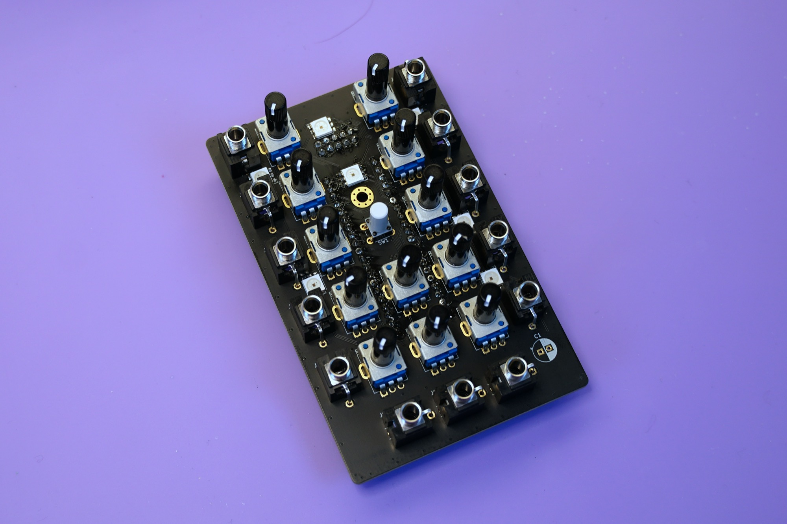
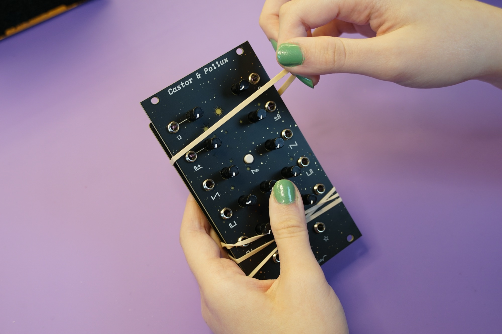
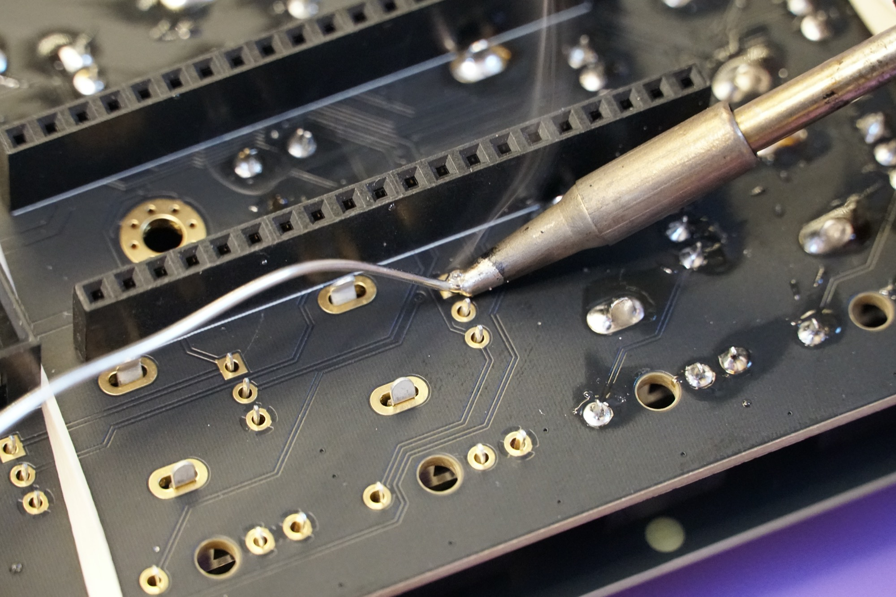
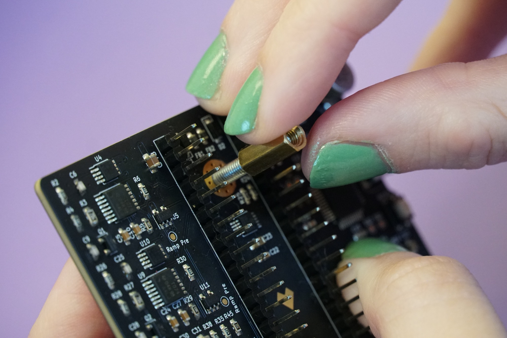
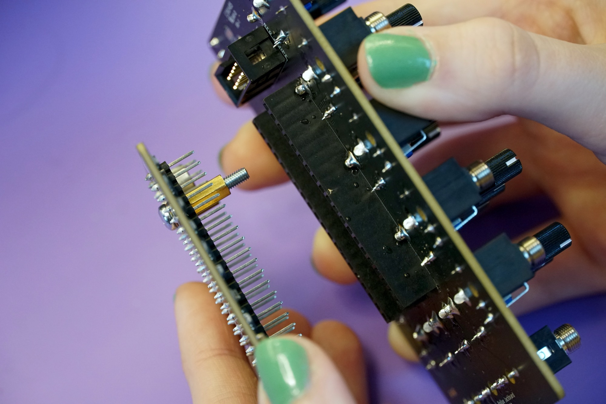
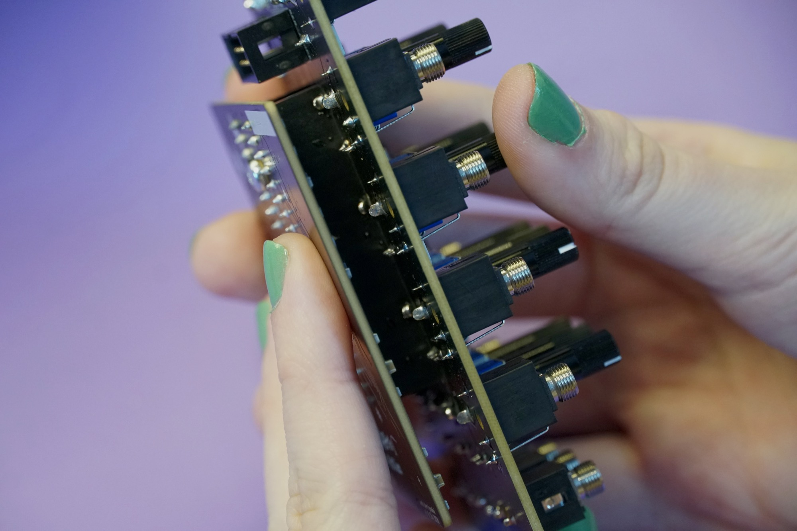
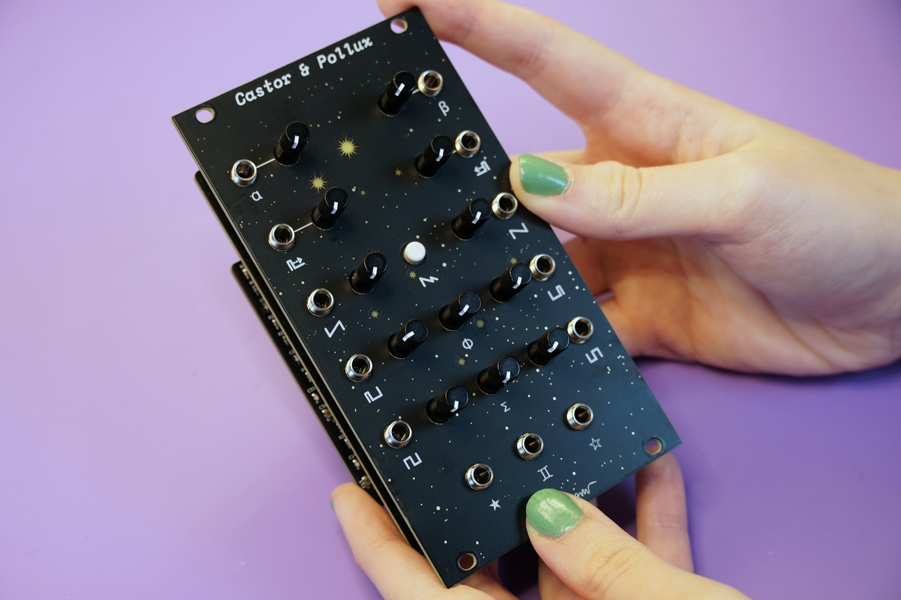

# Castor & Pollux Kit Build Guide

Welcome to the build guide for Castor & Pollux's DIY kit. We hope you have a great time putting this module together and a wonderful time using it.

Please **read all instructions** thoroughly before starting. If you have questions or run into trouble please reach out to us on [discord] or drop us an email at support@winterbloom.com

This build is a **intermediate level** kit. You should be comfortable soldering through-hole components and working with [pin headers](https://www.adafruit.com/category/154). If you're not, we encourage you to try out some other kits first, like our [Big Honking Button kit](https://winterbloom.com/store/winterbloom-big-honking-button-kit). Even if you've got some experience, we recommend taking a look at [Adafruit's guide to excellent soldering](https://learn.adafruit.com/adafruit-guide-excellent-soldering) to refresh your knowledge.

This build takes around **three hours** to complete.

## Tools and materials required

Before jumping in, make sure you have:

* A soldering iron, like [this one](https://www.adafruit.com/product/180).
* Solder, we can recommend [Adafruit's 60/40 **no-clean** rosin core solder](https://www.adafruit.com/product/145). We suggest using soldering with "no clean" flux. If you do use a different kind of flux, be sure to carefully clean the flux residue off based on the guidelines provided by the manufacturer of your solder.

## Kit contents

Your kit should contain the following items. If any are missing please email us at support@winterbloom.com.

<object
    alt="Kit contents"
    data-is-svg-map
    data-list="kit-contents-img-datalist"
    data-stylesheet="/styles/kit-contents-svgmap.css"
    data-info-text-template="kit-contents-img-info-text"
    data="../images/kitted-2.svg"
    height="100%"
    id="kit-contents-img"
    type="image/svg+xml"
    width="100%">
</object>
<template id="kit-contents-img-info-text">
    <g id="info-text-container">
        <rect data-size-to="info-text"></rect>
        <text id="info-text">Test test test</text>
    </g>
</template>
<datalist id="kit-contents-img-datalist">
    <option value="mainboard">Mainboard (1)</option>
    <option value="jackboard">Jackboard PCB (1)</option>
    <option value="panel">Front panel (1)</option>
    <option value="pin-sockets">20-pin 2.54" pin sockets (2)</option>
    <option value="jacks">1/8" jacks (13)</option>
    <option value="nuts">Hex nuts for the 1/8" jacks (13)</option>
    <option value="pots">Potentiometers (13)</option>
    <option value="switch">Tactile switch (1)</option>
    <option value="switch-cap">Tactile switch cap (1)</option>
    <option value="screw">M3x18 screw (1)</option>
    <option value="spacer">M3x11 spacer (1)</option>
    <option value="nut">M3 nut (1)</option>
    <option value="power-header">Eurorack power header (1)</option>
    <option value="power-cable">Eurorack power cable (1)</option>
    <option value="mounting-screws">M3x6 screws (4)</option>
    <option value="rubber-bands">Rubber bands (2)</option>
</datalist>

<link rel="stylesheet" href="/styles/svgmap.css"/>

- (1) Castor & Pollux mainboard
- (1) Castor & Pollux jackboard printed circuit board (PCB)
- (1) Castor & Pollux front panel
- (2) 20-pin 2.54" pin sockets
- (12) 1/8" jacks
- (12) Hex nuts for the 1/8" jacks
- (13) Potentiometers
- (1) Tactile switch
- (1) Tactile switch cap
- (1) Eurorack power header
- (1) Eurorack power cable
- (1) M3x18 screw
- (1) M3x11 spacer
- (1) M3 nuts
- (4) M3x6 screws for attaching the module to your rack
- (2) Rubber bands

We program, test, and calibrate the mainboard before sending it to you, so you don't have to worry about any of that- once you're done building you'll be good to go!

## Soldering the power header

Your first task is to solder the 10-pin Eurorack power connector.

The power connector goes on the **back** side of the board. When placing **note the notch in the outline on the board**. You'll need to make sure the **slot on the connector matches where the notch is on the outline**.

Once placed you can solder the 10 pins on the other side of the board. Be careful here and avoid touching the small components near the pins with your iron.

!!! warning "Watch out for those LEDs!"
    Avoid touching the LEDs with your iron- they really don't like being melted and they're very hard to replace.

## Soldering the pin headers

Next up is the two 20-pin sockets.

They also go on the **back** side of the board, just like the power header. The easiest way to get everything aligned is to place the sockets on the matching headers on the mainboard:

And then place the jackboard onto the sockets:

Now you can solder all the pins. For each header, you should solder one of the pins at the edge first and make sure the sockets are flush against the board before continuing. It's much easier to fix alignment when you only have one pin to deal with.

Once you're done, remove the mainboard and set it aside.

## Placing the front-side components

Now that you're done with the components on the back, it's time to take on the front. You'll need to place all of the components **before soldering** them - trust us, it'll make things easier.

Start with the tactile switch. It goes right in the middle of the board:

Go ahead and put the cap on it as well. It takes a little force, but it should snap into place.

Next, place all of the potentiometers. You might have to give their little legs a squeeze to get them to fit into place.

Finally, put in all of the 1/8" jacks. They don't snap into place like the button and the potentiometers, so don't flip the board upside-down or you'll undo all of your work!

Once complete, your jackboard should look like this:

## Using the front panel as a jig

Since the front-side components need to peek through the front panel, you can use it as a jig to make sure everything stays in the right place. Carefully put the front panel on, taking care to line up the holes.

Now take the two rubber bands and use them to hold the whole assembly together while you're soldering. Put one at the top and one at the bottom, and double them over until they're tight enough to hold the components in place.

## Solder the front-side components

You're now ready to solder all of those front-side components. We recommend that you start with the tactile switch, being careful not to hit the pin sockets with your iron:

Next, solder the potentiometer right underneath it - again, be careful not to hurt the pin sockets:

Now you can solder all of the other components. As you solder, be sure to check that the front panel and all of the components are held in place and flush. You can move the rubber bands around as needed to get to all of the pads.

Once you're done, remove the rubber bands and the panel. You won't need the rubber bands again, so feel free to re-use those.

## Attaching the mainboard to the jackboard

The mainboard and jackboard connect to each other through the 20-pin headers and sockets. To make sure everything is aligned correctly and stays in place, there's also a screw that fastens them together.

First, take the M3x18 screw and place it through the mounting hole in the mainboard. It should be facing the same way as the pin headers.

Next, take the M3 standoff and screw it onto the screw by hand until it's flush with the mainboard. Don't over-tighten it.

Now take the jackboard and connect it to the mainboard using the pin headers and sockets. The screw should go through the matching hole in the middle of the jackboard:

Finally, take the M3 nut and place it onto the exposed end of the screw and tighten it with your fingers.

If you have trouble with this, you can use a small screwdriver to back the screw out a little and then screw it into the nut. Be careful not to over-tighten.

## Putting the panel on

The last step is to put Castor & Pollux's lovely panel on:

Finish it up by screwing the 1/8" jack nuts onto the jacks- again, don't over-tighten them.

## All done

Congratulations! You've finished your very own Castor & Pollux!

Now that it's all put together go check out the [User's Guide](/index) and please show us your work by tweeting at [@wntrblm](https://twitter.com/wntrblm) or tagging [@wntrblm](https://instagram.com/wntrblm) in your instagram post.

[discord]: https://discord.gg/UpfqghQ
