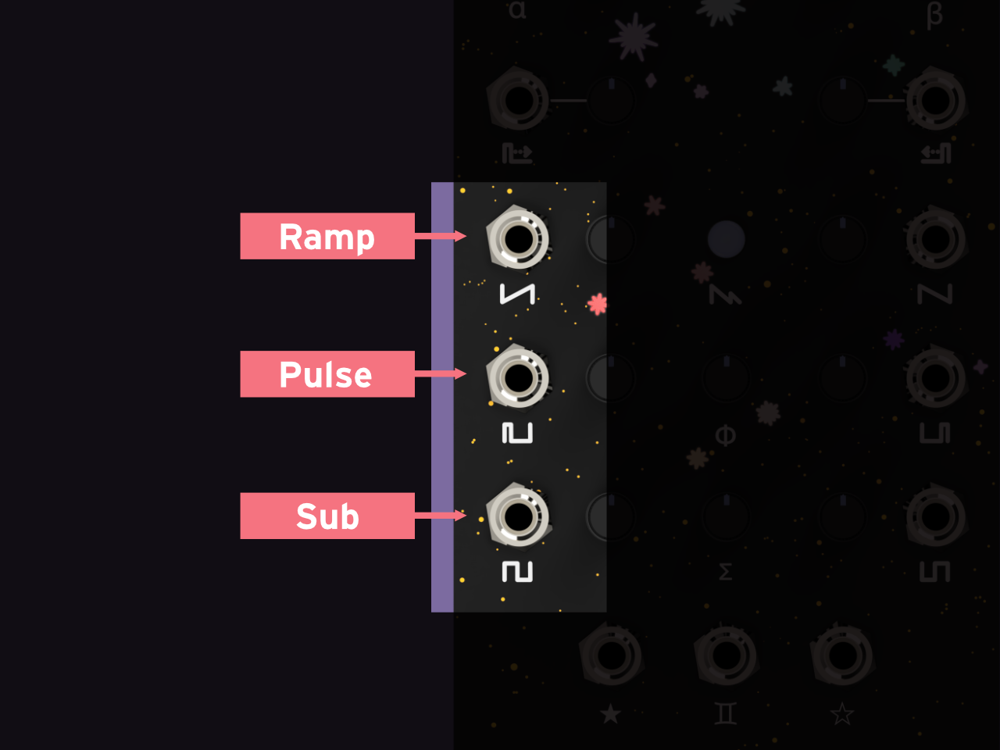
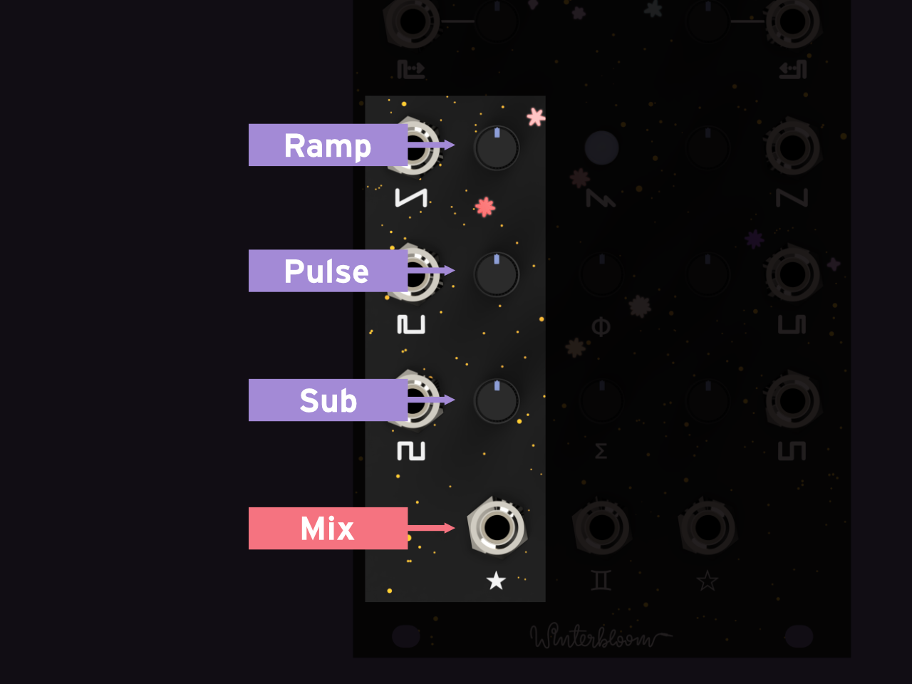
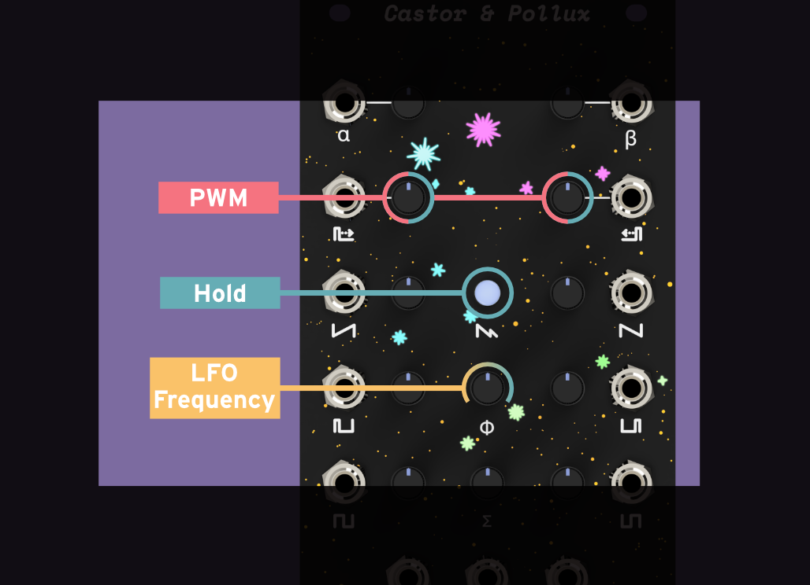

# Castor & Pollux User Guide

[Castor & Pollux](https://winterbloom.com/store/winterbloom-castor-and-pollux) is a Roland Juno-inspired oscillator. It contains two digitally-controlled analog oscillators implemented using a faithfully modernized version of the original Juno 106 design. Like its inspiration, it can give you that wonderful 80s sound with independent and mixed ramp, pulse, and sub outputs. But the twins do not stop there- the second oscillator can be used to layer in thick detuned sounds, harmonically complex hard synced waveshapes, or as a fully independent second oscillator.

[TOC]

## Specifications

* [$249 MSRP](https://winterbloom.com/store/winterbloom-castor-and-pollux)
* 14 HP
* +12v @ 100mA, -12v @ 35mA
* 25mm deep
* 2 separate oscillators
* 7 octave range
* 9 total outputs with waveform outputs and onboard mixers
* Pitch CV ins (0 to 6v) and pitch knobs (-1 to +1 octave, configurable)
* Pulse-width CV ins and knobs
* Hard sync
* Hardware chorusing
* Internal low-frequency oscillator
* [ModularGrid page](https://www.modulargrid.net/e/winterbloom-castor-pollux)

## Getting support and help

We want you to have a wonderful experience with your module. If you need help or run into problems, please reach out to us. Email is the best way for product issues, whereas Discord and GitHub are great for getting advice and help on how to customize your module.

* Send us [an email](mailto:support@winterbloom.com)
* File a bug [on GitHub](https://github.com/theacodes/Winterbloom_Castor_and_Pollux/issues)
* Reach out on the [Discord][discord]

## Installing the module

To install this into your Eurorack setup:

1. Connect a Eurorack power cable to your power supply and the back of the module. **Note that even though the power connector on the module is keyed, double check that the red stripe is on the side labeled `red stripe`!**
1. Screw the module to your rack's rails.

## Inputs and outputs

Castor & Pollux contains *two* separate oscillators. Each has two inputs with associated knobs:

- A pitch CV input. The range is 0v to +6v.
- A pitch knob. The range is -1 octave to +1 octave and is added to any incoming pitch CV. These have a special response curve that makes it easier to [tune the oscillators](#tuning).
- A pulse width CV input. This changes the pulse width of the pulse wave. The range is 0v to +5v.
- A pulse width knob. When combined with the pulse width CV it sets the *minimum* pulse width.

Each oscillator also has three dedicated waveshape outputs:

- A ramp wave output
- A pulse wave output
- A sub square wave output

Each waveshape is nominally 10v peak-to-peak. You can read more about the sound of each waveshape in the [waveshape](#waveshape) section.

Each oscillator also has a waveshape mixer that contains level knobs for each waveshape and a mix output:

The [waveshape](#waveshape) section also shows how mixing the waveshapes affects the waveshape and sound.

There is also a combined output that mixes the output from both oscillators mixer together. It has a crossfader knob to determine which oscillator is more prominent in the mix:

The [oscillator stacking](#oscillator-stacking) section has more details and sound samples of combining the oscillators together.

Finally, there is a knob to enable chorusing and a button to enable hard sync:

The [chorusing](#chorusing) section goes into more detail and has some sound samples, and the [hard sync](#hard-sync) section shows how hard sync affects the second oscillator.

## Tuning

Castor & Pollux is an analog oscillator with a digital brain. It's calibrated during assembled to accurately track 1 volt/octave on the *CV inputs* and you can use the *pitch knobs* to adjust the tuning of each oscillator.

In order to make tuning easier, the pitch knobs have a **non-linear** response: they are less sensitive in the middle of their range than the edges. It's usually easier to understand this visually, so try out this little demonstration:

    <label for="linear_tune">Linear response</label>
    <canvas id="linear_tune_canvas" width="640" height="50" class=""></canvas>
    <output id="linear_tune" name="linear_tune">440 Hz</output>
    <label for="non_linear_tune">Non-linear response</label>
    <canvas id="nonlinear_tune_canvas" width="640" height="50" class=""></canvas>
    <output id="non_linear_tune" name="non_linear_tune" class="teal">440 Hz</output>

    <input type="range" id="tuning_slider" name="tuning_slider"
            min="-1.0" max="1.0" step="0.001" value="0.0">
    <label for="tuning_slider">pitch knob</label>

Notice that with the non-linear response it's much easier to tune to frequencies around `440 Hz`. This is how Castor & Pollux's pitch knobs work. You can configure how strong this effect is using the [settings editor](#editing-module-settings).

## Waveshapes

Just like the Juno, Castor & Pollux has three waveshape outputs: ramp, pulse, and sub.

The ramp wave looks like this (click the image to start and stop the animation):

<canvas id="ramp" width="640" height="480" class="waveform teal"></canvas>

!!! note "Simulation vs reality"
    These are *simulations* of perfect waveshapes. Castor & Pollux's waveshapes are generated by analog circuitry and they
    don't quite look *exactly* like these examples. That's a good thing - the analog weirdness is what adds character to
    the module.

The ramp sounds like this:

    <audio title="ramp wave" controls crossorigin="anonymous" src="https://storage.googleapis.com/files.winterbloom.com/gemini/ramp_octaves.mp3"></audio>

    <audio title="ramp with filter" controls crossorigin="anonymous" src="https://storage.googleapis.com/files.winterbloom.com/gemini/ramp_filtered.mp3"></audio>

The pulse wave depends on the pulse width CV and knob. You can vary the pulse width in this animation to see how it affects the waveshape:

<canvas id="pulse" width="640" height="480" class="waveform purple"></canvas>

    <input type="range" id="pulse_width" name="pulse_width"
            min="0" max="1.0" step="0.01" value="0.5">
    <label for="pulse_width">pulse width</label>

You can also configure the [internal low-frequency oscillator](#internal-low-frequency-oscillator) to modulate the pulse width.

Here's some examples of the pulse wave's sound:

    <audio title="pulse wave" controls crossorigin="anonymous" src="https://storage.googleapis.com/files.winterbloom.com/gemini/square_octaves.mp3"></audio>

    <audio title="pulse with pulse-width modulation" controls crossorigin="anonymous" src="https://storage.googleapis.com/files.winterbloom.com/gemini/square_pwm.mp3"></audio>

    <audio title="pulse with filter" controls crossorigin="anonymous" src="https://storage.googleapis.com/files.winterbloom.com/gemini/square_filtered.mp3"></audio>

Finally, there's the sub waveshape. It's a square wave that's one octave lower. Here's what it looks like:

<canvas id="sub" width="640" height="480" class="waveform red"></canvas>

And here's some sound samples of the sub waveshape:

    <audio title="sub wave" controls crossorigin="anonymous" src="https://storage.googleapis.com/files.winterbloom.com/gemini/sub_octaves.mp3"></audio>

    <audio title="sub with filter" controls crossorigin="anonymous" src="https://storage.googleapis.com/files.winterbloom.com/gemini/sub_filtered.mp3"></audio>

These these waveshapes can be mixed together to produce much more complex and interesting waveshapes - try playing with the sliders under this animation and seeing how it affects the waveshape:

<canvas id="mix" width="640" height="480" class="waveform teal2"></canvas>

    <input type="range" id="ramp_mix" name="ramp_mix"
            min="0" max="0.5" step="0.01" value="0.5">
    <label for="ramp_mix">ramp volume</label>

    <input type="range" id="pulse_mix" name="pulse_mix"
            min="0" max="0.5" step="0.01" value="0.25">
    <label for="pulse_mix">pulse volume</label>

    <input type="range" id="pulse_width_mix" name="pulse_width_mix"
            min="0" max="1.0" step="0.01" value="0.5">
    <label for="pulse_width_mix">pulse width</label>

    <input type="range" id="sub_mix" name="sub_mix"
            min="0" max="0.5" step="0.01" value="0.25">
    <label for="sub_mix">sub volume</label>

Here's some sound samples of various mixes:

    <audio title="ramp & sub" controls crossorigin="anonymous" src="https://storage.googleapis.com/files.winterbloom.com/gemini/ramp_and_sub.mp3"></audio>

    <audio title="sub & pulse" controls crossorigin="anonymous" src="https://storage.googleapis.com/files.winterbloom.com/gemini/ramp_and_square_with_pwm.mp3"></audio>

    <audio title="various mixes" controls crossorigin="anonymous" src="https://storage.googleapis.com/files.winterbloom.com/gemini/waveform_mixing.mp3"></audio>

## Oscillator stacking

Because Castor & Pollux has two oscillators, you can combine them together to build much more complex sounds. When there is no input into the second oscillator's pitch CV jack, it will follow the pitch of the the first oscillator. You can use the pitch knob of the second oscillator to *detune* the second oscillator and cause interesting interactions with the first oscillator. You'll take your output from the **combined output** (marked by the symbol ♊︎) and you can control the relative volume of the two oscillators using the **crossfader** (marked by the symbol Σ).

You can play around with this interactive animation to see how detuning and mixing changes the final waveshape:

<canvas id="stacked" width="640" height="480" class="waveform purple2"></canvas>

    <input type="range" id="stacked_detune" name="stacked_detune"
            min="-1" max="1" step="0.01" value="0.25">
    <label for="stacked_detune">detuning</label>

    <input type="range" id="stacked_mix" name="stacked_mix"
            min="0" max="1.0" step="0.01" value="0.5">
    <label for="stacked_mix">crossfader (Σ)</label>

This animation just uses the ramp waveshape, but the crossfader takes the mix from each oscillator's mixer, so you can combine many different waveshapes. Here's some sound samples of oscillator stacking:

    <audio title="stacked complex waveforms" controls crossorigin="anonymous" src="https://storage.googleapis.com/files.winterbloom.com/gemini/stacked_complex.mp3"></audio>

    <audio title="stacked sub & ramp" controls crossorigin="anonymous" src="https://storage.googleapis.com/files.winterbloom.com/gemini/twilight.mp3"></audio>

    <audio title="stacked sub & pulse" controls crossorigin="anonymous" src="https://storage.googleapis.com/files.winterbloom.com/gemini/steps.mp3"></audio>

## Chorusing

Inspired by the original Juno's analog chorus circuit, Castor & Pollux contains an adaptation of chorusing that works well for a monophonic voice. Instead of applying the chorus affect *after* sound generation, Castor & Pollux's chorusing works by varying the frequency of the second oscillator using an [internal low-frequency oscillator](#internal-low-frequency-oscillator). This means that you have to [use both oscillators](#oscillator-stacking) in order to hear this effect. The **chorus knob** (marked by the symbol φ) determines the intensity of chorusing from none when fully counter-clockwise to its maximum at fully clockwise. The **crossfader** (marked by the symbol Σ) also has an impact on the intensity of the chorus. Finally, you can modify the speed of the chorus by changing the [internal low-frequency oscillator's frequency](#internal-low-frequency-oscillator).

You can play around with this interactive animation to see how the chorusing amount changes the final waveshape. You'll need to click on the animation to start it otherwise you won't really be able to see the chorusing effect.

<canvas id="chorusing_" width="640" height="480" class="waveform red2"></canvas>

    <input type="range" id="chorusing_amount" name="chorusing_amount"
            min="0" max="1" step="0.01" value="0.25">
    <label for="chorusing_amount">chorusing amount (φ)</label>

Here's some sound samples of chorusing:

    <audio title="chorusing" controls crossorigin="anonymous" src="https://storage.googleapis.com/files.winterbloom.com/gemini/chorusing.mp3"></audio>

## Hard sync

[*Hard sync*](https://en.wikipedia.org/wiki/Oscillator_sync) is a feature seen in several synthesizer voices that have two or more oscillators, however, it's not a feature seen on the original Juno because each voice only had one oscillator. Since Castor & Pollux has two oscillators to work with it has an adaption of hard sync. Hard sync allows you to sync the second oscillator to the first - the output will retain the same *base frequency* as the first oscillator but the waveshape will be impacted by the frequency of the second oscillator. In other words, it'll sound like the same note but have a much different timbre.

To use hard sync **tap** the hard sync button - the LEDs should all change to the same color. You'll use the first oscillator's pitch CV to set the note and you'll use the second oscillator's pitch knob or pitch CV input to control the timbre. You'll take the output from the second oscillator (or the combined output) - since hard sync does not impact the waveshape of the first oscillator.

Here's some sound samples of hard sync:

    <audio title="hard sync" controls crossorigin="anonymous" src="https://storage.googleapis.com/files.winterbloom.com/gemini/hard_sync.mp3"></audio>

!!! note "Heads up"
    Due to the way hard sync works, you shouldn't set the second oscillator to a *lower* frequency than the first. It'll just result in the sound growing softer since the second oscillator doesn't have enough time to output a complete wave cycle.

## Internal low-frequency oscillator

Castor & Pollux has an built-in low-frequency oscillator (*LFO*) that's used for modulation. This LFO drives the [chorus](#chorusing) feature, but can also be assigned to some other parameters.

To configure the internal LFO, **hold** down the hard sync button. The module's lights should change. While holding the hard sync button you can modify the following settings:

1. Moving the **chorus knob** (φ) will change the frequency of the LFO. The LEDs at the bottom of the module will pulse to show the LFO's frequency.
2. Moving the **pulse width** knob of each of the oscillators will enable or disable LFO routing to the oscillator's pulse width. Turning the knob counter-clockwise will disable the LFO, turning it clockwise will enable it. The LEDs near the oscillator will illuminate if the LFO is enabled. When the LFO is enabled, the pulse width knob will control the *intensity* of the pulse width modulation instead of directly setting the pulse width.

You can also configure the values for these settings at boot-up using the [settings editor](#editing-module-settings).

## Editing module settings

Even though Castor & Pollux uses analog circuitry to make its beautiful sounds, there is a little microcontroller brain inside that's orchestrating everything. There's a few settings you can tweak over USB, such as the LED brightness and the range of the pitch knobs. Head over to the [web-based settings editor](settings) to tweak to your heart's content.

## Updating the firmware

1. Download the latest firmware [from GitHub](https://github.com/theacodes/Winterbloom_Castor_and_Pollux/releases). It will be a `.uf2` file.
1. Connect Castor & Pollux to your computer via USB. The USB port is located underneath the panel. Note that you still have to power the module from a Eurorack power supply.
1. Place Castor & Pollux in bootloader mode by pressing the reset button twice quickly. The reset button is located just below the USB port. Once in bootloader mode, you should see a drive on your computer named `GEMINIBOOT`.
1. Copy the `uf2` file from step 1 to the `GEMINIBOOT` drive. The module should restart by itself.

## Open source hardware & software

Castor & Pollux is completely open source and hacking is encouraged.

* The [firmware](https://github.com/theacodes/Winterbloom_Castor_and_Pollux/tree/main/firmware) is available under the [MIT License](https://github.com/theacodes/Winterbloom_Castor_and_Pollux/main/firmware/LICENSE). Note that the firmware uses some third-party libraries that are under different, but compatible terms. Read the full text of the license for more details.
* The [hardware designs](https://github.com/theacodes/Winterbloom_Castor_and_Pollux/tree/main/hardware) is available under the permissive [CERN-OHL-P v2](https://cern-ohl.web.cern.ch/) and is designed using [KiCAD](https://kicad.org/) which is free and open-source. You can open the hardware files using KiCAD or you can check out a PDF of the schematics for the [mainboard](https://github.com/theacodes/Winterbloom_Castor_and_Pollux/raw/main/hardware/mainboard/mainboard.pdf) and the [jackboard](https://github.com/theacodes/Winterbloom_Castor_and_Pollux/raw/main/hardware/jackboard/jackboard.pdf).

{class=oshw} Castor & Pollux is [certified open source hardware](https://certification.oshwa.org/US001060.html)

## Warranty, disclaimers, and limits

Modules purchased from Winterbloom have a warranty of six months from the date of purchase. This warranty covers any manufacturing defects in the module. It does not cover damage from due to incorrect handling, storage, or power, overvoltage events, or modifications.

Please [contact us](mailto:support@winterbloom.com) if you are experiencing issues with your module. Modules returned under warranty will either be refunded, replaced, or repaired at our discretion. You will be responsible for the cost of returning the module to Winterbloom.

Because Eurorack has a vast number of possible combinations of power supplies, modules, cases, and accessories, it is impossible for us to guarantee compatibility with every possible configuration. We make a reasonable effort to test modules with several power supplies, cases, and other modules.

We encourage tinkering, however, we will not refund, repair, or replace any products that have been modified.

We have stress tested Castor & Pollux under the following conditions. These are provided for reference only; we do not guarentee that that the module will function under these conditions.

* Overvoltage from power supply: ±18 volts
* Reverse voltage from power supply: ±18 volts
* Undervoltage from power supply: ±10 volts
* Over and under voltage on inputs: ±8 volts
* Output connected to another output: ±8 volts
* Ouput shorted to ground: 60 minutes

## Acknowledgments and thanks

Castor & Pollux would not be possible without the help of the Adafruit, support from Microchip, and the volumes of literature documenting and analyzing the Juno's DCO design.

[discord]: https://discord.gg/UpfqghQ

<link rel="stylesheet" href="styles/waveforms.css">

<link rel="stylesheet" href="styles/winter_oscilloscope.css">

